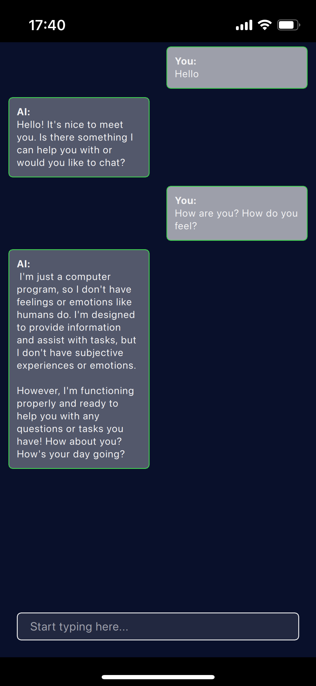

# QllamaTalk
QllamaTalk is an experimental AI chatbot application that demonstrates how to integrate Qt and llama in a single project.<br>
*Mac Usage Example*<br>

<br>*iPhone Usage Example*<br>


## Environment
QllamaTalk has been tested on the following setups:
1. **Windows 10** with **Qt 6.8.1 (MSVC2022 64-bit)**  
2. **macOS (Sonoma 14.3.1)** with **Qt 6.8.1 for macOS**  
3. **Ubuntu 22.04.5** on VMWare with **Qt 6.8.1 (Desktop Kit)**  
4. **iOS 17** with iPhone 13 mini with **Qt 6.8.1 for iOS**
5. **iOS 18** with iPhone 11 with **Qt 6.8.1 for iOS**


## How to Build & Run
1. **Clone this repository**  
   ```bash
   git clone https://github.com/mhirai-bit/QllamaTalk.git
   ```

2. **Navigate to the QllamaTalk directory**  
   ```bash
   cd QllamaTalk
   ```

3. **Open `CMakeLists.txt` in Qt Creator**  
   - Choose one of the Kits specified in the “Environment” section.
   - The cmake configuration and generation process automatically updates the `llama.cpp` submodule and compiles it.
     - On macOS and iOS, [llama_setup.cmake](cmake/llama_setup.cmake) enables Metal for inference.
     - On other platforms, it defaults to CPU-based inference.  
     - **Note (for other than macOS and iOS)**: CPU-only inference can be slow and may heavily use the CPU. If you want to enable GPU acceleration on another platform, refer to the [llama.cpp build instructions](https://github.com/ggerganov/llama.cpp/blob/master/docs/build.md) and modify `llama_setup.cmake` accordingly.
   - The cmake configuration and generation process also automatically downloads the default model.
   
4. **Build and run the application**  
   - In Qt Creator, press the **Build and Run** button (or use the **Ctrl+R** / **Cmd+R** shortcut).  

## Remote Server Feature
QllamaTalk supports both local and remote inference modes:

**Local Mode**: Runs inference directly on your machine, using llama.cpp.<br>
**Remote Mode**: Connects to a remote server via Qt Remote Objects. The remote server also uses llama.cpp but runs in its own process or environment.

### Switching Between Local & Remote
In QML (or via your UI), you can switch between Local and Remote modes.
If you supply ipAddress and portNumber, the app attempts to connect to a remote LLaMA server (e.g., tcp://192.168.0.120:12345).
If the remote connection fails, QllamaTalk automatically falls back to local mode.
### Error Recovery
When an inference error occurs (for example, if tokenization or decoding fails), QllamaTalk attempts to:

1. Re-initialize the engine (either local or remote) in the background.
2. If the error happens on the remote server, it emits a signal to the client, and the client may decide to:
Stay in remote mode, waiting for the server to recover, or
Fall back to local mode automatically (after some timeout).
On the server side, a function such as reinitEngine() is called to free and recreate the LLaMA model context, ensuring the system can recover from a bad state. On the client side, LlamaChatEngine provides a similar reinitLocalEngine() method if local inference fails.

### How to build & run the server
You can open the CMakeLists.txt inside LLMServerQtRemoteObjects folder. This is a git submodule.<br>
This project has been tested with **macOS (Sonoma 14.3.1)** with **Qt 6.8.1 for macOS** . <br>
You can build and run this server on your Mac and access it from the client.

## Known Issues
1. The inference may occasionally produce garbled or irrelevant output. This might be due to the quality of the chosen model, but the exact cause is still unclear.
2. Under certain text inputs or conditions, the application can crash with the following error:
   ```
   Qt has caught an exception thrown from an event handler. Throwing
   exceptions from an event handler is not supported in Qt.
   You must not let any exception whatsoever propagate through Qt code.
   libc++abi: terminating due to uncaught exception of type std::invalid_argument: invalid character
   ```
   The crash is not consistently reproducible with the same text, so the cause remains uncertain.

## Future Plans
1. Support Android
2. Support embedded Linux environments
3. Add voice input and output functionality
